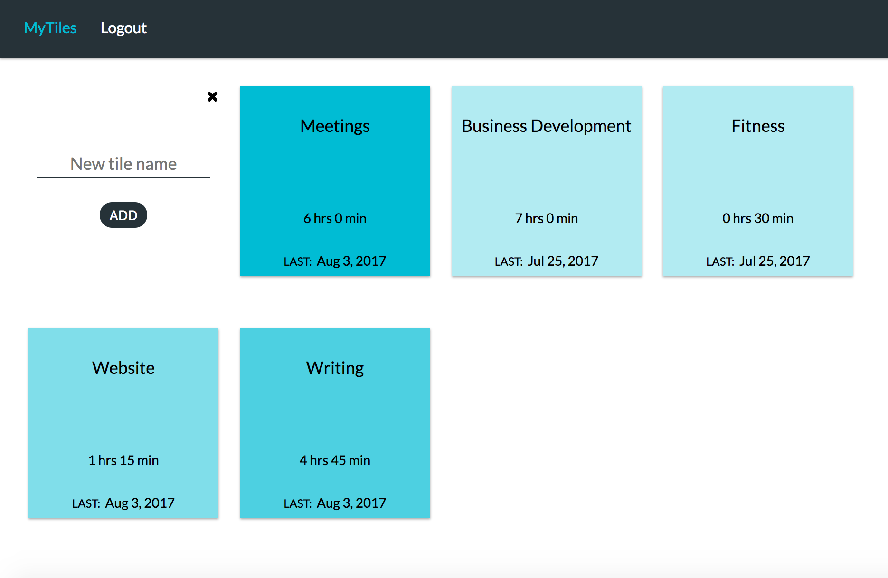
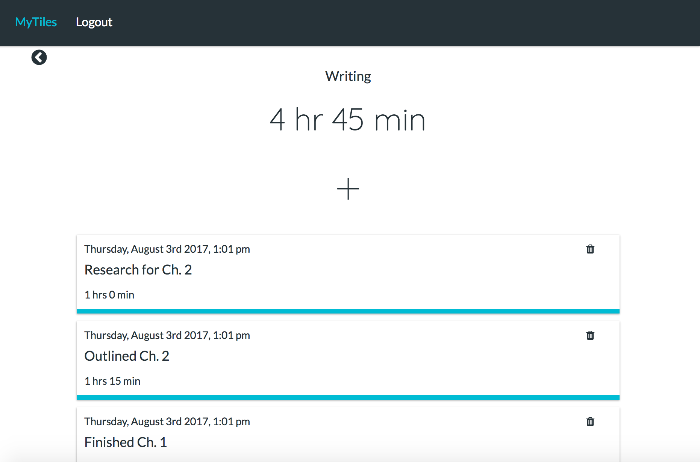
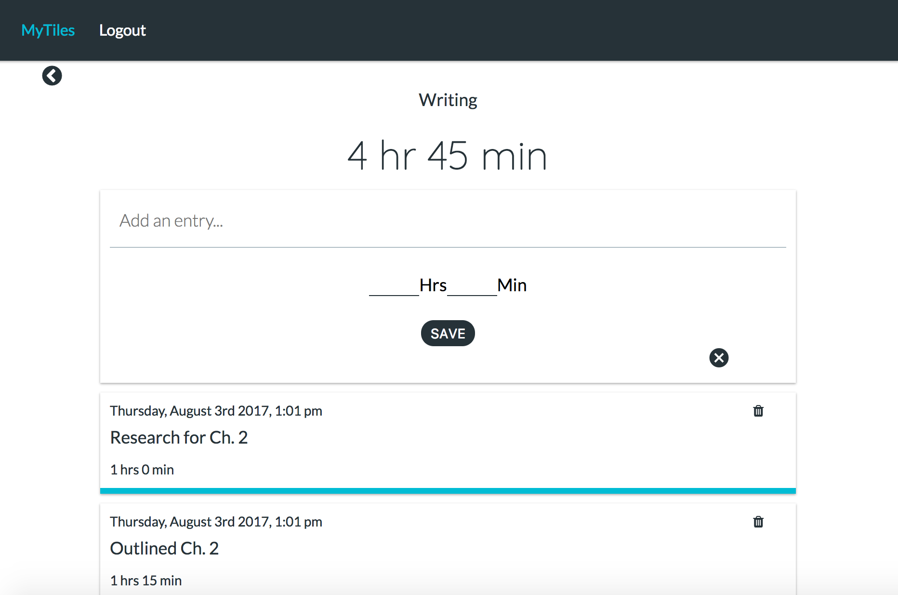

TimeTiles
=================

TimeTiles allows you to track the time you spend toward your goals.

## Demo

You can test the app live <a href="https://timetiles.herokuapp.com/">here</a>.

Sign up for an account, or use the following:

email: test@email.com
password: tiles

## Setup

To install locally, clone the repository and install dependencies with `npm install`. Then from to the project's root directory run the application with `npm start`.

You must also clone and run the <a href="https://github.com/afharrington/trackerapi/"> API</a> on a separate port.

## Usage

After signing in, you will be taken to your dashboard where you can view all existing tiles - you can think of these as your goals. Tile colors deepen a shade for each  hour spent toward the goal, and lighten a shade every two days without an entry.

To add an entry, click a tile to be taken to its entry page. Click the + to expand the form and add your entry and time spent.
